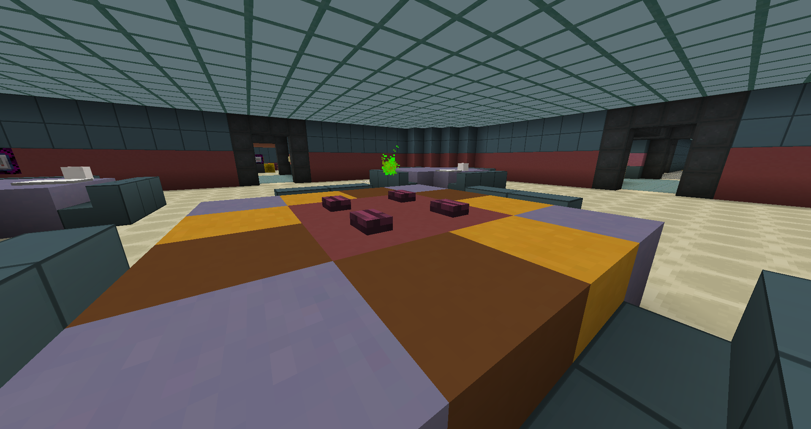
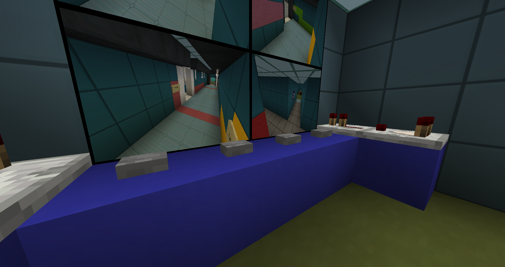
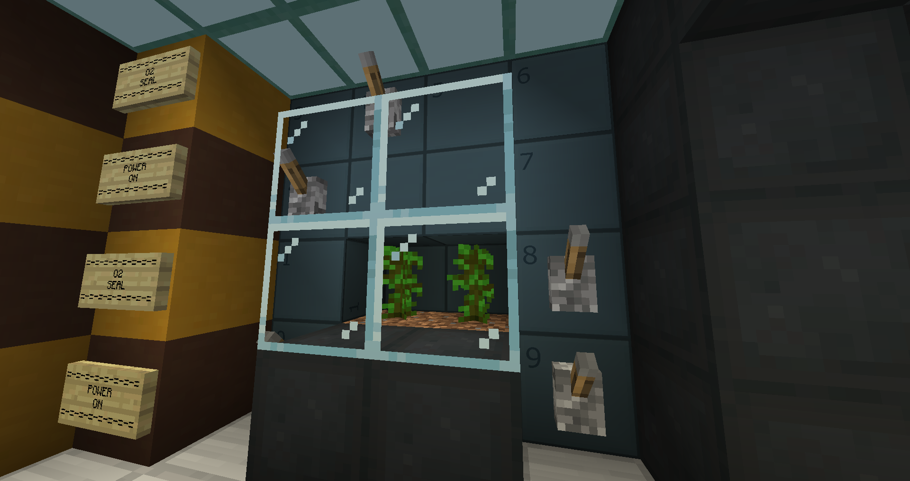

# Among Us Tutorial

Last update: 10/14/2020 - Not finished  
Hint: Use `ctrl+f` to search through this document.

## Note

**Make sure you have partials turned on, if you do not you will not be able to tell which task in the room is active.** To turn on partials navigate to `Options > Video Settings > Particles` And make sure it is either set to `Minimal` or `All`.

## Rules:

***Failure to follow the following rules may result in a ban from all Among Us Sessions.***

1. Do not talk during the game unless an emergency meeting is called.
2. If you are a ghost don't press button emergency meeting, security, or admin buttons.
    - Emergency Meeting and Security Buttons:  
       
3. Event administrators reserve the right to create any rule not listed above.

## Roles:

- **All roles**
    - The Task List can be triggered by right-clicking “Locate Task” item. You will see the location of your assigned task in the chat.
    - Open the map to see roughly where you are, it is not live, it will show you in the closest room to you.
    - Command Blocks will have a particle effect in from of them if there is a task. To activate a task, go up to the command block and click it. You will still be vulnerable during this time.
    - If you cannot enter a task, it means either you are not close enough to the button, the task is occupied (by a Crewmate or a Ghost).
- **Crewmates**
    - The Admin room will help display additional information about tasks.
    - Crewmates can report a body by walking up to the body and right-clicking the "Report Body" item that appears in your hotbar.
    - Crewmates can call emergency meetings at any time by using the buttons on the starting table in table in the cafeteria. 
- **Impostors**
    - Sabotage buttons are in your inventory (not the hotbar). Move the item into your hotbar and click it to activate.
    - Impostors can physically fake tasks by activating the command blocks. They are given 6s of invisibility during this time, and the task will become invisible for a while.
    - Impostors can complete the Inspect Sample task.
    - Impostors can kill TWO players if one of them is doing a task. This is a “double kill”.
    - Impostors can only sabotage doors that are nearby.
- **Ghosts**
    - Ghosts cannot walk through walls, but are given a huge speed boost.
    - Ghosts can fix sabotages.
    - Ghosts can complete tasks.

## Tasks:

After activating a task you will be teleported to the task room. On the far side of the room will be the directions for that specific task. You might need to walk around or use items (if needed items will be provided in a chest to your right) to complete the task. Once successfully completed you will be teleported back to the main map.

If you run into any issues while doing a task you can press the reset button to your left. If you run into further issues you may use discord voice to contact your sessions' admin.

## Sabotage:

All sabotage tasks are marked through walls as a small red triangle. (If you are far away it's shape may not be apparent, look for a red indicator / dot)

- Lights 
  - Need to flip all the levers within the electrical room.
- Reactor meltdown
  - Need to hold both buttons on either side of the reactor room. Buttons are located on glowstone lamps, they will light up when pressed.
- Communications 
  - Press the button when the green block is located between the two tan blocks.
- O2
  - Flip the levers that appear near the plant in the O2 room, then press the button in Admin room.  
  	
- Doors
  - No fix, on timer... *whispers: behind you*.