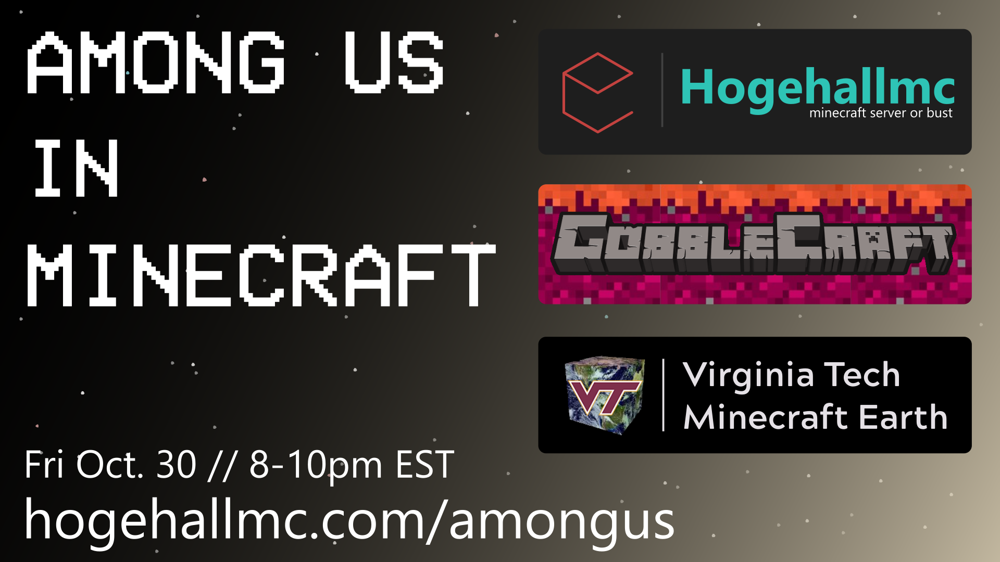
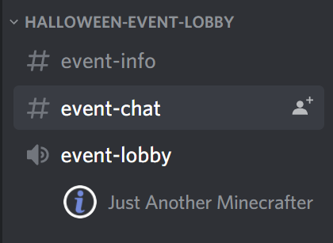
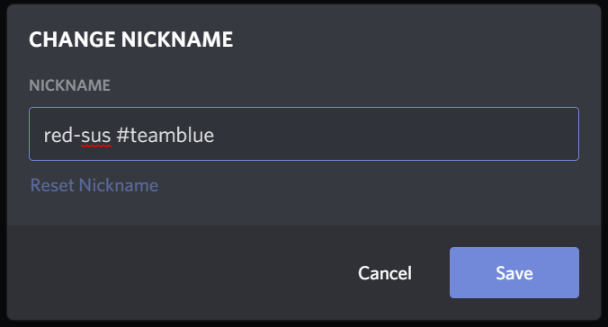

A collaborative effort between [Hogehallmc](https://hogehallmc.com/), [GobbleCraft](https://gobblerconnect.vt.edu/organization/gobblecraft/), and [The VT Build the Earth Team](https://www.vtearth.mhdser.com/) brings you Among Us in Minecraft this Halloween! Suit up and join us as we journey through space completing tasks and calling out sus teammates.

## About

For two hours on Hallow's Eve's Eve (Friday Oct 30) from 8 to 10pm (est) we will be hosting multiple Among Us in Minecraft sessions for you to join. No this isn't a Among Us themed build session, we've actally found a [port of Among Us into Minecraft](https://phoenixsc.me/download-links/among-us-1-16-3/), we thought this discovery was just too cool not to share.

To join simply follow the steps listed below in [Joining](#joining). Once you join the Discord Server don't hesitate to ask the admins questions about the event if you have any.

We've done some testing and found that while the original version of the game is intuitive, the Minecraft version is a little more confusing, to get you up to speed we will be making a tutorial video so join the [Discord Server](https://discord.gg/D8dh3Z8) and stay turned.

If you have a group that you wanna play with be sure to read [Want to join with a group?](#want-to-join-with-a-group) at the bottom of this page before the event. If you have any questions feel free to ask them in our Discord Server.

## Joining

1. Join our [Discord Server](https://discord.gg/D8dh3Z8)!
2. Connect to the Halloween Event Lobby Voice Channel:  
   
3. Wait for a staff member to route you into a server voice channel!
4. Connect to the server address listed in the Text Channel right above your voice channel!
5. Open our Among Us in Minecraft [cheat sheet](cheatsheet.html)!
6. Survive!

## Requirements

- A copy of Minecraft ([Java Edition](https://www.minecraft.net/en-us/store/minecraft-java-edition), the edition from the Microsoft App Store will not work)
- Some experience playing the original Among Us (its free for smart phones)
- Discord
- A microphone (or really quick typing skillz)

## Want to join with a group?

If you are joining with a group come up with a group name before joining, once you join the Discord server have everyone in your group add a `#` and then your group name after your name so that we know who is with who.  
